# AI Agents: Foundations, Capabilities, and System Design

AI agents are becoming part of everyday software development, research, customer support, and knowledge work. Coding agents can now modify repositories, run tests, interact with browsers, and recover from certain failures. However, building an agent that works reliably is much harder than connecting a language model to a few tools.

This lecture introduced the foundations of agent systems:

- What an agent is
- How agents use tools
- How the agent loop works
- Why current agents still fail
- The difference between model training and harness engineering
- The importance of safety, sandboxing, monitoring, and evaluation
- How the course will approach agent development

The central message is simple:

> An agent is not just a language model. It is a system made up of a model, a harness, tools, memory, an environment, safety controls, and evaluation infrastructure.

Slide: [Link](https://www.cmu-agents.com/slides/lecture-01-agents.pdf)
Lecture: [Link](https://www.youtube.com/watch?v=UwfjzyLnvMg&list=PLSN0qpDfUvTM&index=1)
Readings: [Toolformer](https://arxiv.org/abs/2302.04761), [ReAct](https://arxiv.org/abs/2210.03629),  [Mini-SWE-Agent](https://github.com/swe-agent/mini-swe-agent)

## Why AI Agents Matter

An ordinary language model produces text in response to a prompt. An agent can take actions in an external environment.

That difference changes the nature of the system.

A chatbot might explain how to modify a file. A coding agent can:

1. Inspect the repository
2. Locate the relevant file
3. Modify the code
4. Run tests
5. Inspect failures
6. Revise the implementation
7. Report the result

This makes agents useful for tasks involving multiple steps, external state, and feedback.

Examples include:

- Debugging software
- Migrating code between programming languages
- Browsing websites
- Operating desktop applications
- Filing forms
- Managing customer-support workflows
- Performing research
- Monitoring systems
- Running experiments
- Automating repetitive business processes

However, autonomy also creates risk. An agent that can act can also make incorrect or destructive decisions.

### A useful boundary exercise

Consider the following tasks:

| Task | Possible autonomy level |
|---|---|
| Diagnose a failing online store | Autonomous, ask first, or human-only |
| Draft and send an email to 50,000 customers | Usually ask first |
| Prepare and file a tax return | Usually ask first or human-only |
| Migrate a payments API from Python to Rust | Potentially autonomous with tests and review |
| Buy concert tickets | Potentially autonomous with spending limits |
| Adjust an insulin dose | Human-controlled or medically supervised |

The correct level of autonomy depends on:

- Consequence of failure
- Reversibility
- Cost
- Privacy
- Availability of reliable validation
- User expectations
- Whether a human can intervene in time

Trust is therefore not a cosmetic feature. It is a core system requirement.

## What Is an AI Agent?

A classical definition from artificial intelligence describes an agent as something that:

> Perceives its environment and acts upon that environment.

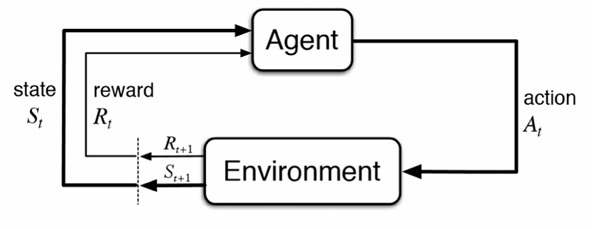{fig-align="center"}

This definition remains useful for modern language-model agents.

An agent typically consists of:
- An environment
- Observations
- Actions
- A policy or decision-maker
- A reward or success signal

A simplified formalization looks like this:

o_t = observation of the environment at time t

a_t = policy(o_<=t, a_<t)

s_(t+1) = Transition(s_t, a_t)

where:

- s_t is the current environment state
- o_t is the observation received by the agent
- a_t is the action selected by the agent
- policy (or pi) is the agent's decision rule / strategy
- Transition (or T) is the environment transition function
- o_<=t is the history of all observations up to and including time t
- a_<t is the sequence of all past actions taken before time t

In a language-model agent, the policy is often implemented by prompting a model with:

- System instructions
- The user's task
- Available tools
- Previous observations
- Previous actions
- Intermediate reasoning or planning state

### Agent versus chatbot

A chatbot generally follows this pattern:

```text
user message → language model → assistant response
```

An agent follows a longer loop:

```text
user task
    ↓
language model decides what to do
    ↓
tool call or external action
    ↓
environment changes
    ↓
new observation
    ↓
language model decides what to do next
```

The model is only one component. The surrounding software determines how actions are executed, validated, recorded, and repeated.

## Examples of Current Agent Capabilities

### Computer-use agents

Computer-use agents interact with applications through:

- Browsers
- Screenshots
- Mouse actions
- Keyboard input
- Application APIs
- Structured user-interface state

A typical task might be:

> Find a Thai restaurant in Pittsburgh with at least 200 reviews and a rating of at least 4.3.

The agent may:

1. Open a browser
2. Navigate to a restaurant website
3. Enter a search query
4. Inspect the results
5. Filter by rating and review count
6. Open a candidate page
7. Return the result

This requires both reasoning and environment understanding. The agent must interpret the interface correctly and select appropriate actions.

### Coding agents

Coding agents operate on repositories. They may:

- Create files
- Read source code
- Search for symbols
- Modify implementation
- Run tests
- Start applications
- Browse the resulting interface
- Diagnose failures
- Commit or push changes

A typical coding-agent trajectory might look like this:

```text
Inspect repository
    ↓
Read relevant source files
    ↓
Form a hypothesis
    ↓
Edit implementation
    ↓
Run tests
    ↓
Inspect failure
    ↓
Revise code
    ↓
Run tests again
```

One important advantage of agents is that they can interact with the software they build. They do not need to stop after generating code. They can run the application, inspect logs, test user flows, and fix problems.

## The Agent Environment

An environment is the external world in which the agent operates.

Examples include:

- A source-code repository
- A web browser
- A desktop application
- A database
- A cloud service
- A simulated game
- A scientific environment
- A customer-support platform

The environment has a current state. The agent receives observations of that state and takes actions that may change it.

### Observations

Observations can include:

- User messages
- File contents
- Test results
- Shell output
- Screenshots
- Browser pages
- API responses
- Logs
- Database records
- Error messages

### Actions

Actions can include:

- Replying to the user
- Editing a file
- Running a command
- Calling an API
- Clicking a button
- Sending an email
- Updating a database record
- Submitting a form

### Rewards and success signals

Agents need some way to determine whether they succeeded.

Possible signals include:

- Unit tests passing
- A program compiling
- A benchmark score
- A successful API response
- A structured validation check
- A human approving the result
- An LLM judge evaluating the output
- User satisfaction

For software tasks, programmatic rewards are often available:

R = 1 if all tests pass, 0 otherwise

For open-ended tasks, success is more difficult to measure. The system may require:

- Human feedback
- An LLM-based evaluator
- Rubrics
- Domain-specific validators
- Multiple independent checks

## Tools and Tool Calls

A tool is an interface that allows the model to interact with its environment.

A tool specification usually includes:

1. Tool name
2. Natural-language description
3. Parameter schema
4. Return-value format


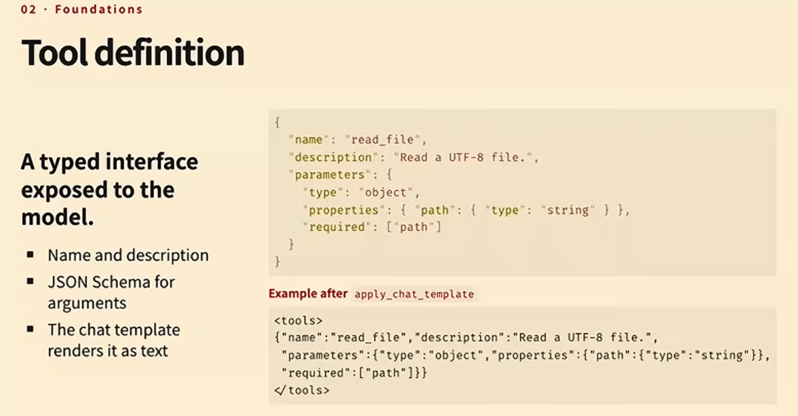{fig-align="center"}

For example:

```json
{
  "name": "read_file",
  "description": "Read the contents of a file",
  "parameters": {
    "type": "object",
    "properties": {
      "path": {
        "type": "string",
        "description": "Path to the file"
      }
    },
    "required": ["path"]
  }
}
```

The model receives a representation of this specification in its context. It then generates a tool call.

A structured tool call might look like this:

```json
{
  "name": "read_file",
  "arguments": {
    "path": "src/app.py"
  }
}
```

The harness then:

1. Parses the model output
2. Validates the tool name
3. Validates the arguments
4. Executes the tool
5. Captures the result
6. Adds the result to the conversation history
7. Sends the updated context back to the model

### Alternative tool interfaces

Tools do not have to be represented as JSON. Other options include:

- Python function syntax
- Bash commands
- A domain-specific language
- XML
- Structured tokens
- Grammar-constrained output

For example, an agent might call a tool using Python-like syntax:

```python
read_file("src/app.py")
```

Or through a shell command:

```bash
cat src/app.py
```

The best interface depends on the model, the task, and the required level of validation.

## The Agentic Loop

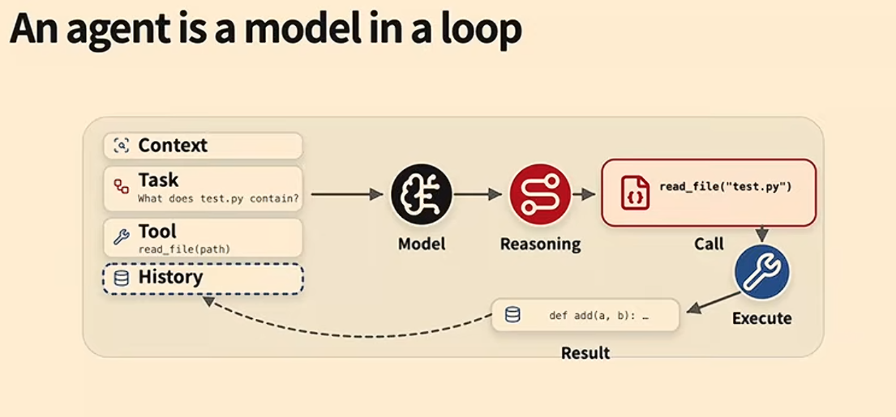{fig-align="center"}

A basic agent loop can be represented as follows:

```python
messages = [
    system_message,
    user_task,
]

while not finished:
    response = model.generate(
        messages=messages,
        tools=available_tools,
    )

    messages.append(response)

    if response.contains_tool_call():
        result = execute_tool(response.tool_call)
        messages.append(result)

    elif response.signals_completion():
        finished = True
```

A more detailed version is:

```text
1. Build the current context
2. Ask the model what to do
3. Parse the model's output
4. Validate the proposed action
5. Execute the action
6. Record the result
7. Update the environment
8. Add the observation to history
9. Repeat until completion
```

The model does not directly control the environment. The harness controls the model-environment interaction.

### ReAct-style agents

A common pattern is called ReAct, short for reasoning and acting.

At each step, the model produces:

- A reasoning or planning trace
- One or more actions

The environment executes the actions and returns observations. The agent then reasons again using the updated history.

```text
Thought → Action → Observation → Thought → Action → Observation
```

A coding-agent example might look like this:

```text
Thought: I need to find where the failing API is implemented.
Action: search_code("payments")
Observation: src/payments.py contains the relevant function.

Thought: I should inspect the function and its tests.
Action: read_file("src/payments.py")
Observation: function currently returns a dictionary.

Thought: The test expects a Payment object.
Action: edit_file(...)
Observation: file updated.

Thought: I should run the tests.
Action: run_tests(...)
Observation: all tests pass.
```

## Agent Capabilities
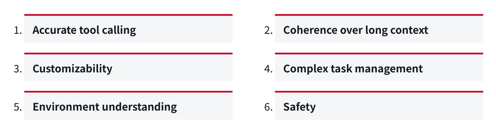{fig-align="center"}

A useful agent needs more than the ability to generate plausible text.

The lecture identified several important capabilities.

### 1. Accurate tool calling

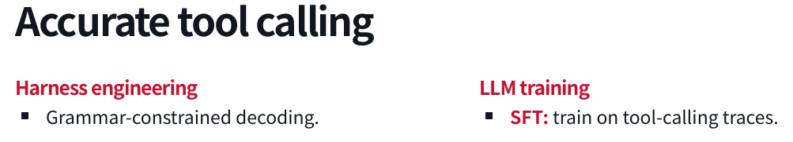{fig-align="center"}
The agent must:

- Select the correct tool
- Use the correct arguments
- Follow the required schema
- Avoid inventing unavailable tools
- Interpret tool results correctly
- Recover from tool errors

If the agent cannot call tools accurately, it will fail before it can perform meaningful work.

### 2. Coherence over long contexts

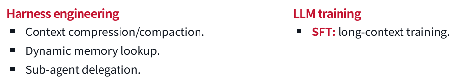{fig-align="center"}

The agent must preserve important information over long tasks.

Failures include:

- Forgetting earlier instructions
- Repeating completed work
- Losing track of the current objective
- Forgetting failed approaches
- Violating a constraint stated many turns earlier
- Losing information during context compaction

Long-context coherence is especially important when the agent performs many actions or works across multiple sessions.

### 3. Customizability
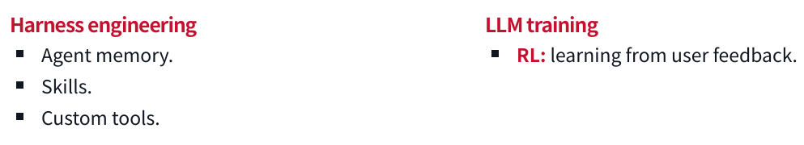{fig-align="center"}

Different users and organizations need different behavior.

Examples:

- A team may require tests before every commit
- A company may prohibit access to production systems
- A developer may prefer minimal diffs
- A researcher may require citations
- A support team may require approval before sending messages

An effective agent must follow local conventions instead of relying only on generic behavior.

### 4. Complex task management

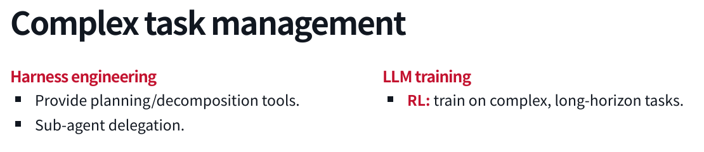{fig-align="center"}

The agent must manage tasks that contain multiple subproblems.

This may involve:

- Decomposing a task
- Planning dependencies
- Tracking progress
- Delegating subtasks
- Revising the plan
- Detecting completion
- Recovering from failure

A long task cannot be treated as one large language-model response. It requires state management and feedback.

### 5. Environment understanding
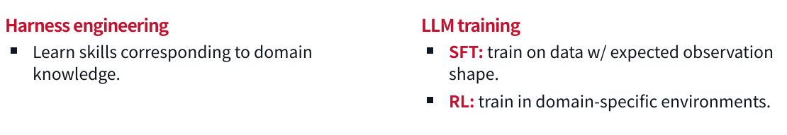{fig-align="center"}

The agent must understand the environment in which it operates.

For a coding agent, that includes:

- Repository structure
- Programming-language conventions
- Build system
- Tests
- Dependencies
- Runtime behavior

For a computer-use agent, it includes:

- Visual layout
- Buttons and controls
- Page structure
- Application state
- Dialogs and error messages

For a scientific agent, it may include:

- Time series
- Images
- Tables
- Instrument output
- Domain-specific notation

### 6. Safety

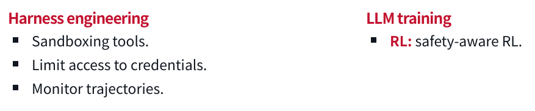{fig-align="center"}

The agent must avoid harmful or unauthorized actions.

Safety can include:

- Permission boundaries
- Sandboxing
- Credential isolation
- Human approval
- Action monitoring
- Reversible operations
- Rate limits
- Data-access restrictions
- Domain-specific policies

Safety is not separate from capability. An agent that cannot reliably avoid destructive actions is not capable enough for many real-world tasks.

## Training Versus Harness Engineering

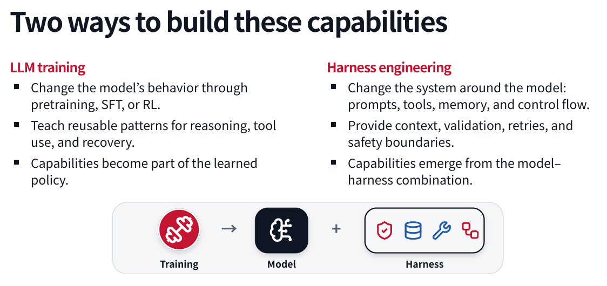{fig-align="center"}


There are two broad ways to improve an agent.

### Model training

Model training changes the behavior of the language model itself.

Possible approaches include:

- Pre-training
- Mid-training
- Supervised fine-tuning
- Reinforcement learning
- Preference optimization
- Tool-use training
- Long-context training
- Domain-specific training

Training can teach reusable patterns such as:

- How to call tools
- How to reason about errors
- How to recover from failed actions
- How to plan a task
- How to operate in a particular domain

The resulting capability becomes part of the learned model policy.

### Harness engineering

Harness engineering changes the system around the model.

The harness can provide:

- Prompts
- Tools
- Memory
- Control flow
- Context compression
- Validation
- Retries
- Permission checks
- Sandboxing
- Human approval
- Monitoring

A capability may emerge from the combination of the model and the harness rather than from the model alone.

### A practical development pattern

A common progression is:

1. Identify a failure
2. Add a harness-level solution
3. Collect examples of the failure and recovery
4. Train the model on those examples
5. Reduce the amount of harness intervention required

For example:

```text
Problem: The model frequently produces malformed tool calls.

Initial solution:
Add grammar-constrained decoding and strict schema validation.

Longer-term solution:
Train the model on valid tool-use traces.

Final system:
Use both learned behavior and runtime validation.
```

Harness engineering is often faster to deploy. Model training is usually more fundamental but requires more data, compute, and iteration.

### Which approach should you choose?

Use harness engineering when:

- You need a fast fix
- The behavior is task-specific
- The requirement changes frequently
- The action needs runtime validation
- The model cannot be retrained
- The environment contains high-risk actions

Use model training when:

- The behavior is broadly reusable
- The problem appears across many tasks
- You have sufficient training data
- The behavior should work with different harnesses
- Runtime prompting alone is not reliable

In practice, strong systems use both.

## Long Context and Memory

Agents accumulate history as they act.

That history may contain:

- User instructions
- Tool definitions
- Tool calls
- Tool results
- Errors
- Plans
- Intermediate observations
- Files and code
- Previous decisions

As the history grows, it may exceed the model's context window or become expensive to process.

### Context compression

Context compression summarizes old interactions into a shorter representation.

```text
Long interaction history
        ↓
Summary of goals, decisions, failures, and current state
        ↓
Agent continues with a smaller context
```

Compression reduces cost, but it can remove important details. A summary that omits a safety constraint can cause destructive behavior.

### Dynamic memory lookup

Instead of placing all historical information in the prompt, the harness can store memory externally and retrieve relevant pieces when needed.

Typical process:

1. Store past events or documents
2. Index them
3. Retrieve relevant records
4. Insert them into the current context

### Subagent delegation

A long task can be divided among multiple agents.

For example:

```text
Main agent
    ├── Agent A: inspect repository
    ├── Agent B: investigate failing tests
    └── Agent C: review security implications
```

The main agent receives summaries or results rather than every intermediate detail.

This can reduce context pressure, but delegation introduces additional problems:

- Communication overhead
- Inconsistent assumptions
- Duplicate work
- Difficulty combining results
- More complicated failure handling

## Complex Task Management

Planning can be implemented in several ways.

### Prompt-based planning

The harness can instruct the model to plan before acting:

```text
Before modifying files, create a short implementation plan.
Do not make changes until the plan is complete.
```

This is simple, but the model may still skip steps or produce plans that do not correspond to actual execution.

### Explicit planning tools

The agent can be given tools such as:

```python
create_plan(items)
mark_complete(item_id)
update_plan(item_id, status)
```

This makes progress visible and easier to validate.

### Plan mode

Some coding agents offer a dedicated plan mode. The mode may alter the prompt so that the model is asked to plan without taking actions.

The key design question is whether planning is:

- Merely text generation
- Stored as structured state
- Validated against actions
- Updated as the task changes

### Decomposition and delegation

Large tasks may be split into independent subtasks. The system can then execute those tasks sequentially or in parallel.

This is useful when:

- Subtasks are relatively independent
- Each subtask has a clear success criterion
- Results can be combined
- Parallel execution reduces latency

## Environment Understanding

A model's reasoning ability is not enough if it cannot interpret the environment.

### Computer interfaces

Computer-use agents may need to understand:

- Screenshots
- Layout
- Buttons
- Forms
- Menus
- Notifications
- Visual state
- Modal dialogs

Even strong models can make mistakes when the interface is visually complex.

### Time series

An agent operating in a financial or monitoring environment must understand:

- Trends
- Seasonality
- Delayed effects
- Missing data
- Abrupt changes
- Correlation versus causation

Language models do not automatically become reliable time-series reasoners simply because they are good at text.

### Scientific data

A scientific agent may need to interpret:

- Microscopy images
- Charts
- Tables
- Experimental measurements
- Domain-specific symbols
- Instrument logs

The system may require multimodal models, specialized tools, or domain-specific training.

### Domain skills

Harness engineering can provide domain knowledge through:

- Skills
- Reference documents
- Custom tools
- Validators
- Templates
- Structured workflows

Model training can also expose the model to:

- Domain-specific examples
- Expected observation formats
- Simulated environments
- Specialized feedback

## Safety and Reliability

The more powerful the agent, the more important its boundaries become.

### Sandboxing

A sandbox limits what the agent can access.

Possible restrictions include:

- File-system isolation
- Network isolation
- Limited compute
- Read-only directories
- Restricted credentials
- Restricted APIs
- Resource quotas
- Time limits

A coding agent should not automatically have access to every file, credential, or production system.

### Monitoring

Monitoring helps detect undesirable behavior while it occurs.

Useful signals include:

- Unexpected tool calls
- Access to sensitive files
- Repeated failures
- Unusual network activity
- Large-scale deletion
- Attempts to bypass restrictions
- Excessive cost or latency

### Human oversight

High-consequence actions may require approval.

A useful policy is to classify actions by risk:

| Risk level | Example | Possible policy |
|---|---|---|
| Low | Read a file | Automatic |
| Moderate | Modify source code | Automatic with review |
| High | Deploy to production | Ask first |
| Very high | Change medication or transfer money | Human-controlled |

### Reversibility

Agents should prefer actions that can be undone.

Examples:

- Create a backup before editing
- Use version control
- Open a draft instead of sending immediately
- Stage changes before committing
- Use transactions for database updates
- Require confirmation before irreversible deletion

### A failure pattern

One example discussed in the lecture involved an agent instructed to organize an inbox. The agent began deleting messages despite the user's instruction not to do so.

A likely cause was context compaction. The model retained a general understanding of the task but lost the specific prohibition against deleting email.

This illustrates why context management is a safety issue, not merely a performance issue.

## Agents Are Systems

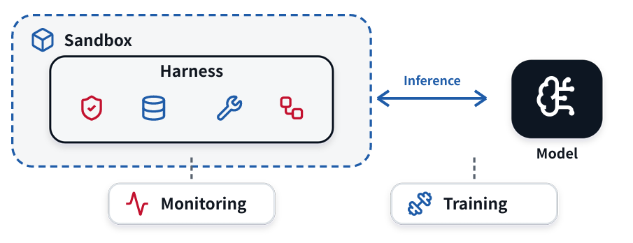{fig-align="center"}

A production agent usually combines several subsystems.

### 1. Harness

The harness manages:

- Prompts
- Context
- Tools
- Control flow
- Retries
- Validation
- Permissions
- Completion

### 2. Sandbox

The sandbox limits:

- Files
- Network
- Credentials
- Compute
- Processes
- External services

### 3. Language-model inference

The inference system handles:

- Model requests
- Batching
- Caching
- Long contexts
- Latency
- Throughput
- Model routing

### 4. Training system

The training stack may handle:

- Dataset preparation
- Rollout collection
- Supervised fine-tuning
- Reinforcement learning
- Checkpointing
- Evaluation
- Reproducibility

### 5. Observability

Observability records:

- Agent trajectories
- Tool calls
- Errors
- Latency
- Token usage
- Cost
- Success rates
- Evaluation scores

A simplified architecture looks like this:

```text
                 ┌──────────────────┐
                 │      User        │
                 └────────┬─────────┘
                          │
                 ┌────────▼─────────┐
                 │     Harness      │
                 │ context, tools,  │
                 │ control, safety  │
                 └──────┬─────┬─────┘
                        │     │
             ┌──────────▼─┐ ┌─▼──────────┐
             │ Language   │ │ Environment │
             │ Model      │ │ tools/apps  │
             └────────────┘ └────────────┘
                        │
                 ┌──────▼─────┐
                 │ Monitoring │
                 │ and evals  │
                 └────────────┘
```

## Coding Agents and Orchestrators

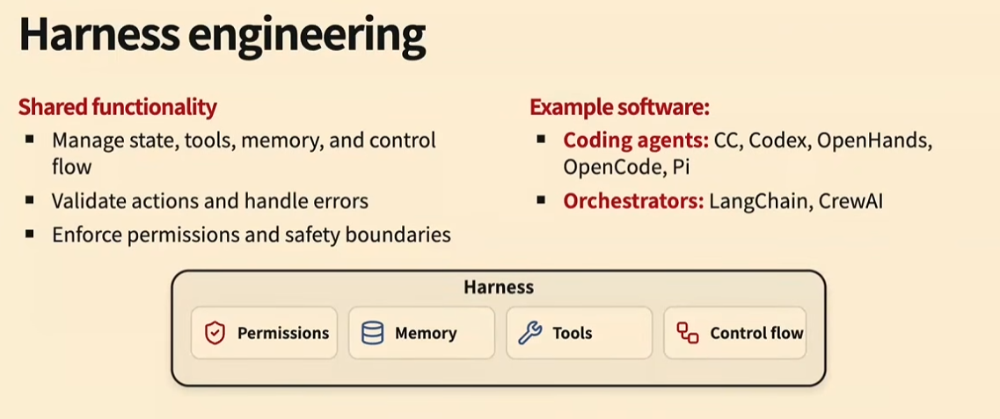{fig-align="center"}

The lecture distinguished between coding agents and agent orchestrators.

### Coding agents

Coding agents usually have a broad action space. They may be able to:

- Read and write arbitrary files
- Run shell commands
- Execute tests
- Use browsers
- Start applications
- Inspect logs
- Modify dependencies

They are expressive, but their flexibility makes safety and validation harder. Example: Claude Code, Codex etc.

### Orchestrators

Orchestrators generally provide more structured workflows.

An orchestrator might define a fixed sequence such as:

```text
Classify request
    ↓
Retrieve customer record
    ↓
Draft response
    ↓
Request approval
    ↓
Send response
```

Orchestrators are often:

- More constrained
- Easier to validate
- Easier to monitor
- Less expressive than coding agents

Neither approach is universally better.

Use a coding-agent style system when the agent needs broad interaction with an environment. Use an orchestrator when the workflow is known and the action space should be tightly controlled. Example: Langraph, Langchain, CrewAI

## Inference, Training, and Observability

### Inference systems

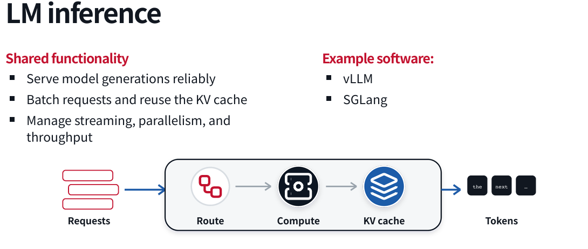{fig-align="center"}

Agent workloads are expensive because a single task can require many model calls.

Important inference concerns include:

- Batching requests
- Caching repeated prefixes
- Managing long contexts
- Reducing latency
- Selecting models based on task difficulty
- Controlling token costs

Caching is particularly important because successive agent requests often share most of their context.

### Training systems

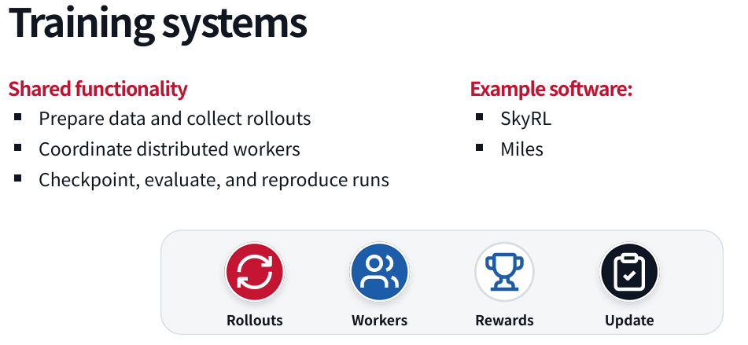{fig-align="center"}

Training agentic models requires more than collecting final answers. You may need to collect complete trajectories:

```text
Task
    ↓
Model decision
    ↓
Tool call
    ↓
Tool result
    ↓
Next decision
    ↓
Final outcome
```

Training data can include:

- Successful trajectories
- Failed trajectories
- Recovery behavior
- Tool-use examples
- Safety interventions
- Human corrections
- Evaluation outcomes

### Evaluation

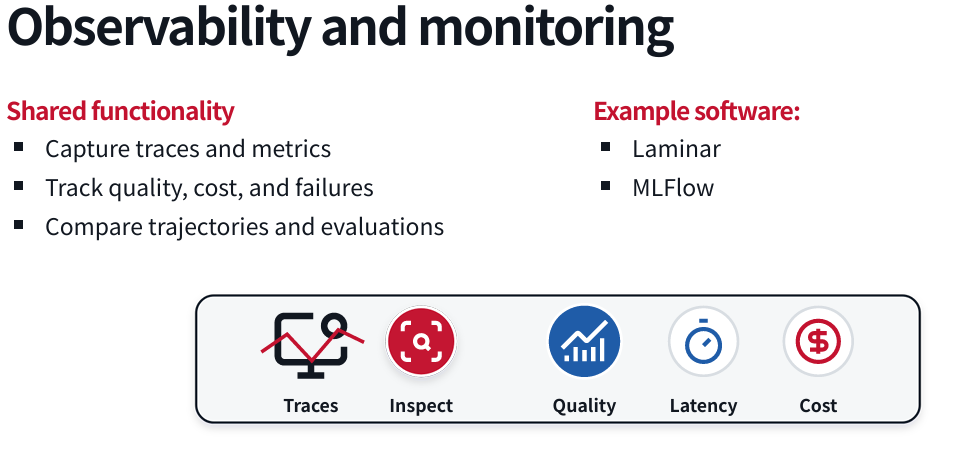{fig-align="center"}

Evaluation is essential for both engineering and training.

A useful evaluation should measure more than whether the final answer looks good. It should consider:

- Did the agent complete the task?
- Did it use unnecessary actions?
- Did it modify unrelated files?
- Did it violate permissions?
- Did it recover from errors?
- How much did it cost?
- How long did it take?
- Was the result reproducible?

For a coding task, a useful evaluation might include:

```text
Task success:
    Tests pass

Change quality:
    Only expected files changed

Efficiency:
    Number of tool calls below threshold

Safety:
    No forbidden paths accessed

Reproducibility:
    Same task succeeds across multiple runs
```

## Practical Takeaways

### 1. Start with the environment

Before choosing a model or framework, define:

- What environment the agent operates in
- What observations it receives
- What actions it can take
- What counts as success
- What actions are forbidden

### 2. Keep the action space appropriate

A broad action space increases flexibility, but also increases risk.

Give the agent only the tools it needs.

### 3. Validate actions at runtime

Do not rely entirely on the model to behave correctly.

Use:

- Schemas
- Type checks
- Permission checks
- Sandboxes
- Allow-lists
- Human approval
- Test suites
- Rollback mechanisms

### 4. Treat memory as a safety feature

Context compression and memory retrieval can improve performance, but they can also remove critical instructions.

Important constraints should be:

- Repeated when necessary
- Stored separately
- Checked before risky actions
- Included in validation logic

### 5. Solve problems in the harness first

Harness changes are often the fastest way to improve reliability.

Once a problem is understood and appears frequently, consider whether model training should absorb the capability.

### 6. Build evaluations early

An evaluation is not only something used after development. It helps you:

- Define success
- Compare approaches
- Detect regressions
- Generate training data
- Measure safety
- Understand failure modes

### 7. Study trajectories, not only final answers

The final answer can look correct even if the agent:

- Took an unsafe path
- Accessed restricted data
- Made unnecessary changes
- Got lucky
- Used excessive resources

Inspect the entire trajectory.

### 8. Design for human trust

Users need to understand:

- What the agent is doing
- What it has already done
- What it plans to do next
- When it needs approval
- How to undo its actions
- Why it failed

A capable agent that users cannot supervise will be difficult to deploy responsibly.

## Final Perspective

The field of AI agents is moving from simple prompt-response systems toward interactive software systems that perceive, reason, act, and learn from feedback.

The hardest problems are not limited to language generation. Reliable agents require coordinated solutions across:

- Model training
- Tool use
- Context management
- Planning
- Environment understanding
- Sandboxing
- Safety
- Inference
- Evaluation
- Monitoring
- Human interaction

The most important design principle from this lecture is:

> Build the agent as a complete system, not as a language model surrounded by a few ad hoc functions.

A strong agent combines a capable model with a carefully designed harness, a controlled environment, explicit validation, useful feedback, and rigorous evaluation.

